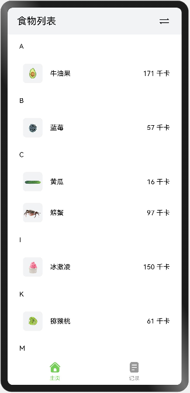
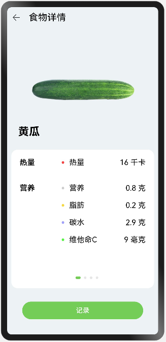
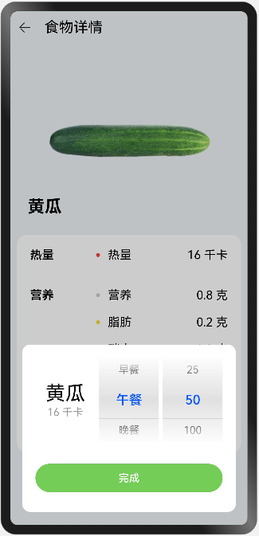
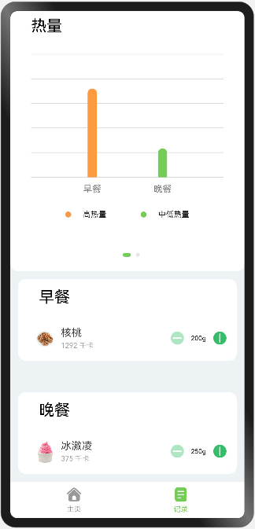

# 健康饮食

## 介绍
这是一个记录饮食和查看食物信息的应用，主要用于管理饮食健康。可以添加饮食信息，包括食物的种类、重量以及用餐时间，如早餐、 午餐、晚餐和夜宵，并能统计得到相应用餐时间的总热量值、总蛋白质、总脂肪和总碳水值，并且用柱状图的形式展示出来。

### 本实例使用了如下API:
[路由跳转](https://developer.harmonyos.com/cn/docs/documentation/doc-references-V3/ts-container-navigator-0000001427584884-V3) ，比如点击食物，可以跳转至相应的食物详情页面。

[一次开发多端部署](https://developer.harmonyos.com/cn/docs/documentation/doc-guides/harmonyos-features-0000000000011907) ，使用其中介绍的自适应布局能力和响应式布局能力进行多设备（或多窗口尺寸）适配，保证应用在不同设备或不同窗口尺寸下可以正常显示。

### 使用说明

1. 本应用一共有“启动动画页面”、“首页”和“食物详情”三个主页面；
2. 启动应用，进入“启动动画页面”，动画播放完成自动进入主页；
3. 首页，使用Tabs组件把首页分为两个页签：“主页”页签和“记录”页签。“主页”页签展示所有食物，支持通过Tab子页签展示的食物分类网格布局和字母排序列表两种方式查看，点击食物项可进入相应的食物详情页面，查看食物详情。食物“记录”页签，展示饮食记录，通过卡片展示不同时间段的饮食信息，卡片信息包含有食物的种类、重量、卡路里值以及用餐时间；以柱状图的形式展示每一餐所有食物的热量值和包含的营养元素含量；可以在卡片里面通过使用加减按钮来修改食物的重量，同时会重新统计相应用餐时间的总热量值、总蛋白质、总脂肪和总碳水值，并且柱状图的数据会及时更新;
5. 食物详情页面，使用滑动组件展示食物的详细信息，包括使用画布组件展示单位重量的食物各个营养元素的的占比,使用进度条组件展示当前食物是否为高热食物，以及展示单位重量的食物所包含的热量、脂肪、蛋白质、碳水以及维他命C值；并且点击记录按钮可以弹出记录饮食的弹窗，包括记录食物的种类、重量以及用餐时间，可以通过点击完成添加饮食，同时添加的饮食信息会在“记录”Tab页签做展示。

## 预览效果
|食物列表               |食物详情          |
|---------------------|--------------------|
|||

|添加饮食               |饮食记录          |
|---------------------|--------------------|
|||

## 相关权限
  不涉及

## 依赖
  不涉及

## 约束与限制
1. 本示例仅支持在标准系统上运行，支持设备：华为手机或者运行在DevEco Studio上的华为手机模拟器。

2. 本示例为Stage模型，从API version 9开始支持。

3. 本示例需要使用DevEco Studio 3.1 Beta2 (Build Version：3.1.0.400)及以上才可编译运行。

